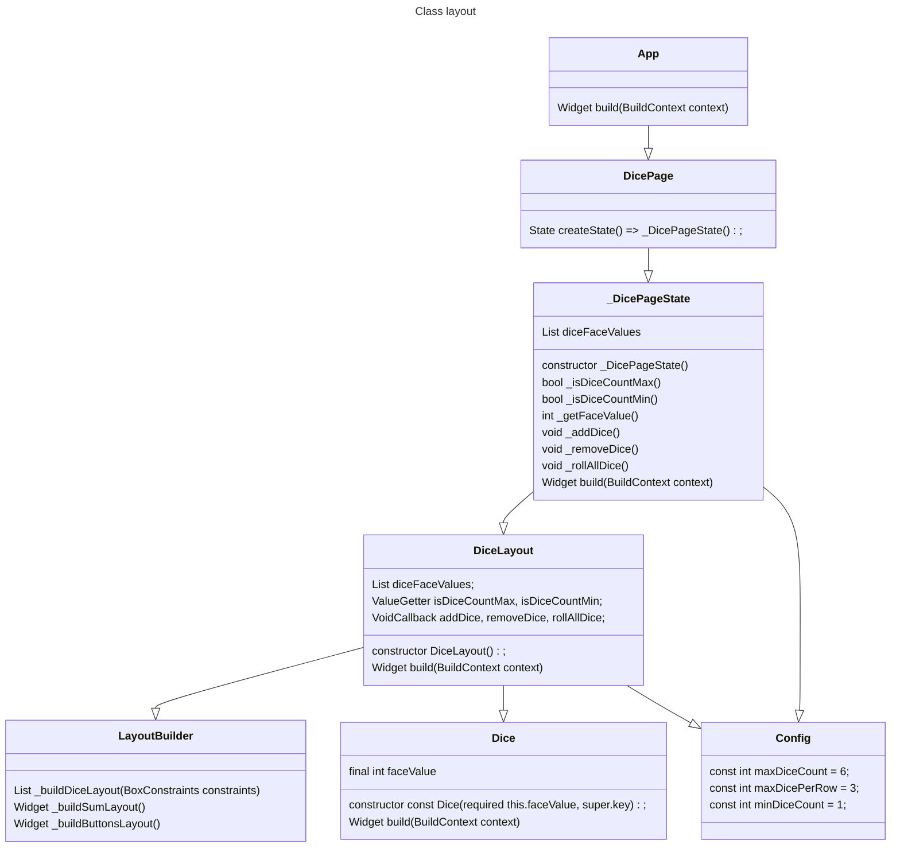
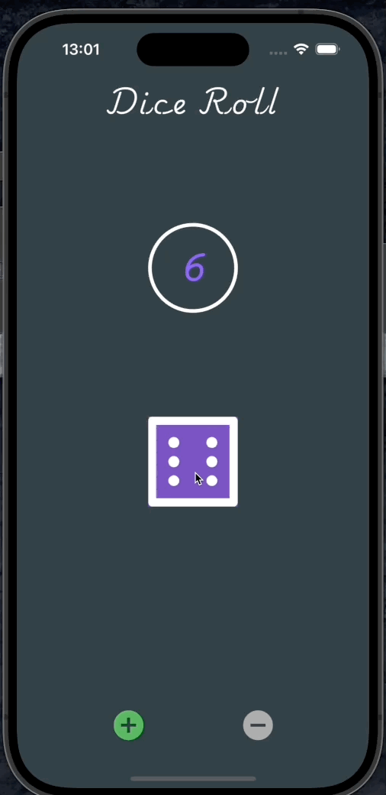
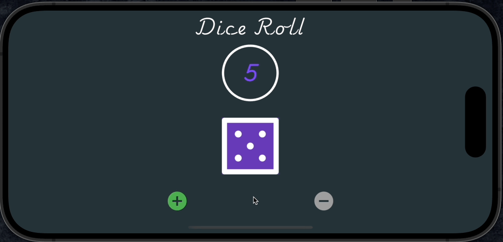

# Dice Roll

A simple app which can be used to play dice games

### Features
 - Add up to 6 dice 
 - use (sudo) random number generator to set dice face to be displayed on screen
 - switch layout dynamically based on available height ( i.e. orientation )
 - displays total count of all dice on screen

### Class Layout

### Demo

### Portrait orientation

### Landscape orientation orientation

### Possible improvements
 - Write Tests
 - Setting page to configure colour 
 - better dice image (perhaps one with illusion of 3D)
 - optimise code/logic
 - custom hand-crafted icons
 - attractive dice-roll animation

